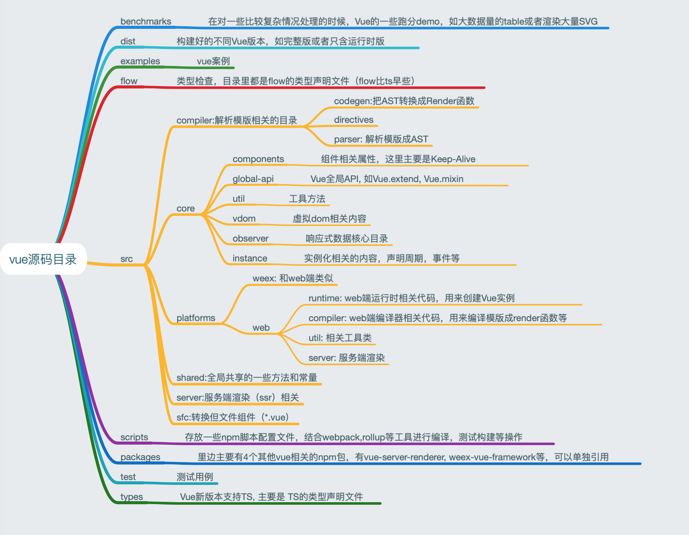

### 双向绑定的实现

##### defineProperty

```javascript
var a= {}
Object.defineProperty(a,"b",{
    value:123
})
console.log(a.b);//123
```


- 第一个参数：目标对象
- 第二个参数：需要定义的属性或方法的名字。
- 第三个参数：目标属性所拥有的特性。（descriptor）
  - value：属性的值(不用多说了)
  - writable：默认false。如果为false，属性的值就不能被重写,只能为只读了
  - configurable：默认false。配置属性的总开关，一旦为false，就不能再设置他的（value，writable，configurable）
  - enumerable：默认false。是否能在for...in循环中遍历出来或在Object.keys中列举出来。
  - get：见代码，使用后，不能用 writable 和 value
  - set：见代码，使用后，不能用 writable 和 value

```javascript
var a= {};
Object.definePrope(a,"b",{
    set:function(newValue){
        console.log("你要赋值给我,我的新值是"+newValue);
    },
    get:function(){
        console.log("你取我的值");
        return 2;
    }
});
a.b =1; // 调用set，打印：你要赋值给我,我的新值是1
console.log(a.b); // 调用get，打印：你取我的值  2
```


### 双向绑定数据：监听，订阅

#### 1、装饰者模式

在不改变对象自身的基础上，在程序运行期间给对象动态的添加职责

#### 2、观察者模式（发布订阅模式）

- 一个或多个发布者对象：当有重要的事情发生时，会通知订阅者。

- 一个或多个订阅者对象：它们追随一个或多个发布者，监听它们的通知，并作出相应的反应

  

   

```
1.数据监听器Observer（发布者），能够对数据对象的所有属性进行监听;
 实现数据的双向绑定，首先要对数据进行劫持监听，所以我们需要设置一个监听器Observer，用来监听所有属性

 2.Watcher（订阅者）将数据监听器和指令解析器连接起来，数据的属性变动时，执行指令绑定的相应回调函数，如果属性发上变化了，就需要告诉订阅者Watcher看是否需要更新。
    
 3.指令解析器Compile，对每个节点元素进行扫描和解析，将相关指令对应初始化成一个订阅者Watcher

 因为订阅者是有很多个，所以我们需要有一个消息订阅器Dep来专门收集这些订阅者，然后在发布者Observer和订阅者Watcher之间进行统一管理的。
```

##### $observe

```javascript

export function observe (value, vm) {
    if (!value || typeof value !== 'object') {
        return
    }
    return new Observer(value)
}

// 根据对象类型决定如何做响应化
export default class  Observer{
    constructor(value) {
        this.value = value
        this.walk(value)
    }
    //递归。。让每个字属性可以observe
    walk(value){
        Object.keys(value).forEach(key=>{
            defineReactive(this.value, key, value[key])
        })
    }
}


export function defineReactive (obj, key, val) {
    var dep = new Dep()
    var childOb = observe(val)
    // 对传入obj进行劫持
    Object.defineProperty(obj, key, { // 不能用 writable 和 alue
        enumerable: true,
        configurable: true,
        get: ()=>{
            // 判断有没有值，就知道到底是Watcher 在get，还是我们自己在查看赋值
            if(Dep.target){
                // 说明这是watch 引起的
                dep.addSub(Dep.target)
            }
            return val
        },
        set:newVal=> {      
            var value =  val
            if (newVal === value) {
                return
            }
            val = newVal
            // 如果传入的newVal依然是obj，需要做响应化处理
            childOb = observe(newVal)//如果新赋值的，new Observer()
            dep.notify()
        }
    })
}

// Dep：依赖，管理某个key相关所有Watcher实例
export default class Dep {
    constructor() {
        this.subs = []
    }
    addSub(sub){
        // 添加订阅
        this.subs.push(sub)
    }
    notify(){
        // 遍历订阅者，也就是Watcher，并调用他的update()方法
        this.subs.forEach(sub=>sub.update()) 
    }
}
```

##### $watch

1. 监听器Observer是在get函数执行了添加订阅者Wather的操作
2. 在订阅者Watcher初始化的时候触发对应的get函数，去执行添加订阅者操作（在Dep.target上缓存下订阅者，添加成功后再将其去掉）

```javascript
// 订阅者:保存更新函数，值发生变化调用更新函数
export default class Watcher {
    constructor(vm, key, cb) {
        this.cb = cb
        this.vm = vm
        //此处简化.要区分fuction还是expression,只考虑最简单的expression
        this.key = key
        this.value = this.get()
    }
    update(){
        this.run()
    }
    run(){
        const  value = this.get()
        if(value !==this.value){
            this.value = value
            this.cb.call(this.vm)
        }
    }
    get(){
        // 判断是不是Watcher的构造函数调用
        Dep.target = this // target静态属性上设置为当前watcher实例
        //此处简化。。要区分fuction还是expression
        const value = this.vm._data[this.key] // 读取触发了getter
        Dep.target = null // 收集完就置空
        return value
    }
}
```


[杨川宝]:https://segmentfault.com/a/1190000004346467
[平平不平]: https://segmentfault.com/a/1190000013035407


### 源码解析



[学员]:https://www.yuque.com/docs/share/2ced968d-ec76-480d-9ccb-3075b4ed5fa9